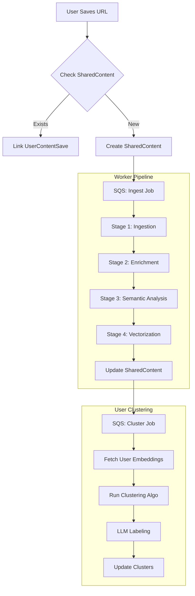

# AI & Data Pipelines

## Overview

This document details the AI and data processing pipelines that power the Content Intelligence platform. The system uses a multi-stage pipeline to transform raw URLs into structured, searchable, and clustered knowledge.

**Key Principles**:
- **Asynchronous Processing**: All heavy lifting happens in background workers.
- **Idempotency**: Pipelines can be retried safely without side effects.
- **Cost Efficiency**: Expensive AI operations run only once per unique content (SharedContent).
- **User Context**: Clustering and personalization happen at the user level.

---

## Pipeline Architecture



---

## Stage 1: Ingestion & Normalization

**Goal**: Convert a raw URL into standardized metadata.

### 1.1 URL Normalization
Before fetching, URLs are normalized to ensure uniqueness (see `api.md` for rules).

### 1.2 Metadata Fetching strategies

| Platform | Strategy | Tools/Libraries | Data Extracted |
|----------|----------|-----------------|----------------|
| **Instagram** | Private API / Scraper | `instaloader` (Python), `rapidapi` | Title, Caption, Thumbnail, Duration, Author |
| **YouTube** | Official API / Scraper | `yt-dlp`, `google-api-python-client` | Title, Description, Thumbnail, Duration, Tags, Transcript |
| **Generic Web** | OpenGraph / HTML | `beautifulsoup4`, `newspaper3k` | OG Title, OG Image, Meta Description, Main Text |

**Implementation Note**:
- Use `yt-dlp` for YouTube as it's more robust than the official API for transcripts and metadata without quotas.
- For Instagram, consider a reliable RapidAPI provider to avoid IP bans if scraping directly.

---

## Stage 2: Content Enrichment

**Goal**: Extract raw text and visual signals from the content.

### 2.1 Audio Transcription (Video Content)
If the content is a video (YouTube/Reel) and no transcript is available:
- **Tool**: OpenAI Whisper (API or local `base` model on GPU worker).
- **Process**: Download audio -> Transcribe -> Save text.
- **Fallback**: If audio download fails, rely on Description/Caption.

### 2.2 Visual Analysis (Optional/Advanced)
For image-heavy content or generic videos:
- **Tool**: GPT-4o (Vision) or local LLaVA.
- **Process**: Sample 3-5 frames -> Generate description.
- **Prompt**: "Describe the visual style, setting, and key objects in these frames."

### 2.3 Text Unification
Combine all sources into a single `content_text` block for analysis:
```python
content_text = f"""
Title: {title}
Caption: {caption}
Description: {description}
Transcript: {transcript[:2000]}... # Truncate if too long
Visual Context: {visual_description}
"""
```

---

## Stage 3: Semantic Analysis (The "Brain")

**Goal**: Understand *what* the content is about using LLMs.

**Model**: GPT-4o-mini (Cost-effective & fast) or Claude 3 Haiku.

### 3.1 System Prompt

```text
You are an expert content analyst. Analyze the provided content metadata and extract structured insights.

Output JSON with the following schema:
{
  "topic_main": "Short, specific topic (max 5 words)",
  "category_high": "One of [Travel, Food & Drink, Learning, Fitness, Tech, ...]",
  "subcategories": ["List", "of", "specific", "tags"],
  "locations": ["List", "of", "places", "mentioned"],
  "entities": ["List", "of", "people", "brands", "products"],
  "intent": "One of [learn, visit, buy, try, watch, misc]",
  "sentiment": "positive/neutral/negative",
  "summary": "One sentence summary"
}
```

### 3.2 Input
The `content_text` block generated in Stage 2.

### 3.3 Output Handling
- Parse JSON response.
- Validate against Pydantic models.
- Store in `shared_content` table.

---

## Stage 4: Vectorization

**Goal**: Convert content into a mathematical vector for similarity search and clustering.

### 4.1 Embedding Model
- **Provider**: OpenAI
- **Model**: `text-embedding-3-small`
- **Dimensions**: 1536
- **Cost**: Very low ($0.02 / 1M tokens)
- **Why**: Excellent performance/cost ratio, standard in industry.

### 4.2 Input Construction
We embed a concise representation, not the full raw text, to reduce noise.
```python
embedding_input = f"{topic_main}: {summary}. Category: {category_high}. Tags: {', '.join(subcategories)}"
```

### 4.3 Storage
- **Database**: Qdrant (Managed Cloud or Docker)
- **Collection**: `shared_content`
- **Payload**: Store `content_id`, `category_high` for filtering.
- **ID Format**: UUID (same as `shared_content.id`).

---

## Stage 5: Clustering (User-Level)

**Goal**: Group a specific user's saved items into meaningful clusters.

**Trigger**:
- **Periodic**: Nightly job for all active users.
- **Event-based**: After user saves N new items (e.g., every 5 items).

### 5.1 The Algorithm: HDBSCAN vs KMeans
We use **Agglomerative Clustering** or **HDBSCAN** because we *don't know* how many clusters (k) a user has.

**Configuration**:
- **Metric**: Cosine Distance
- **Threshold**: 0.2 - 0.3 (Determines how strict the grouping is)
- **Min Cluster Size**: 3 items

### 5.2 Workflow
1. **Fetch Embeddings**: Get all embeddings for `user_id` from Vector DB (filter by `id` in `user_content_saves`).
2. **Run Clustering**: Assign a `cluster_id` (0, 1, 2...) to each item. Items with `-1` are noise (unclustered).
3. **Diffing**: Compare with existing clusters to avoid re-creating the same ones.

### 5.3 Generative Labeling (Naming Clusters)
For each new cluster found:
1. **Sample Items**: Take top 5 items closest to the cluster centroid.
2. **LLM Prompt**:
   ```text
   Here are 5 items from a user's saved collection:
   [List of titles and topics]
   
   Generate a short, catchy label for this group (e.g., "Weekend Baking", "Python Tips").
   Also provide a 1-sentence description.
   ```
3. **Save**: Create `Cluster` record and `ClusterMembership` links.

---

## Tech Stack & Tools

| Component | Technology | Reasoning |
|-----------|------------|-----------|
| **LLM** | OpenAI GPT-4o-mini | Best balance of speed, cost, and reasoning capability. |
| **Embeddings** | OpenAI `text-embedding-3-small` | Cheap, high quality, 1536d standard. |
| **Vector DB** | Qdrant | Fast, Rust-based, excellent filtering, easy local dev (Docker). |
| **Video Tools** | `yt-dlp` | Industry standard for video metadata extraction. |
| **Orchestration** | AWS SQS + Lambda/Fargate | Serverless scaling for bursty workloads. |
| **Clustering** | `scikit-learn` | Robust implementation of Agglomerative Clustering. |

---

## Cost Estimation (Per 1,000 Items)

| Operation | Unit Cost | Est. Units | Total Cost |
|-----------|-----------|------------|------------|
| **Ingestion** | Server Time | 5 hrs (Lambda) | $0.10 |
| **LLM Analysis** | $0.15 / 1M tokens | 1M tokens (1k items * 1k tokens) | $0.15 |
| **Embeddings** | $0.02 / 1M tokens | 0.5M tokens | $0.01 |
| **Vector DB** | Storage | 1k vectors | Free Tier / Negligible |
| **Total** | | | **~$0.30 per 1,000 items** |

**Note**: This is extremely cost-effective. Processing 10,000 items costs ~$3.00.

---

## Error Handling & Retries

- **Ingestion Failures**: Retry 3 times with exponential backoff. If URL is dead, mark status `FAILED`.
- **LLM Rate Limits**: Handle `429` errors with `tenacity` retry library.
- **Partial Success**: If video transcript fails, proceed with just Title/Description (degraded mode).
