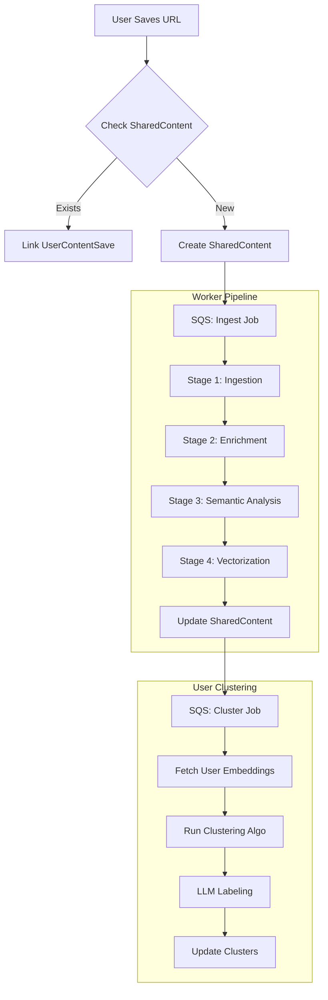

# AI & Data Pipelines

## Overview

This document details the AI and data processing pipelines that power the Content Intelligence platform. The system uses a multi-stage pipeline to transform raw URLs into structured, searchable, and clustered knowledge.

**Key Principles**:
- **Asynchronous Processing**: All heavy lifting happens in background workers.
- **Idempotency**: Pipelines can be retried safely without side effects.
- **Cost Efficiency**: Expensive AI operations run only once per unique content (SharedContent).
- **Strong Classification**: Content is classified into a `content_category` during processing (NOT user-dependent).
- **Per-Category Clustering**: Clustering groups items WITHIN each content_category.

## Classification vs Clustering Architecture

**Important Distinction**:

| Aspect | Classification | Clustering |
|--------|---------------|------------|
| **When** | During content processing | After classification, per-user |
| **Scope** | Global (per SharedContent) | User-specific |
| **Output** | `content_category` (e.g., Food, Travel) | Cluster label (e.g., "Cafe Hopping in Indiranagar") |
| **Dependency** | None - pure content analysis | Requires `content_category` to be set |
| **Immutability** | Immutable after READY status | Re-computed as user saves more |

**Flow**:
```
1. User saves URL
   ↓
2. ContentPipeline processes SharedContent
   ↓
3. AI Analysis assigns content_category = "Food" (STRONG, TIGHT classification)
   ↓
4. Clustering job runs for user
   ↓
5. Groups user's Food saves into clusters like "Cafe Hopping in Indiranagar"
```

---

## Pipeline Architecture



---

## Stage 1: Ingestion & Normalization

**Goal**: Convert a raw URL into standardized metadata.

### 1.1 URL Normalization
Before fetching, URLs are normalized to ensure uniqueness (see `api.md` for rules).

### 1.2 Metadata Fetching strategies

| Platform | Strategy | Tools/Libraries | Data Extracted |
|----------|----------|-----------------|----------------|
| **Instagram** | Private API / Scraper | `instaloader` (Python), `rapidapi` | Title, Caption, Thumbnail, Duration, Author |
| **YouTube** | Official API / Scraper | `yt-dlp`, `google-api-python-client` | Title, Description, Thumbnail, Duration, Tags, Transcript |
| **Generic Web** | OpenGraph / HTML | `beautifulsoup4`, `newspaper3k` | OG Title, OG Image, Meta Description, Main Text |

**Implementation Note**:
- Use `yt-dlp` for YouTube as it's more robust than the official API for transcripts and metadata without quotas.
- For Instagram, consider a reliable RapidAPI provider to avoid IP bans if scraping directly.

---

## Stage 2: Content Enrichment

**Goal**: Extract raw text and visual signals from the content.

### 2.1 Audio Transcription (Video Content)
If the content is a video (YouTube/Reel) and no transcript is available:
- **Tool**: OpenAI Whisper (API or local `base` model on GPU worker).
- **Process**: Download audio -> Transcribe -> Save text.
- **Fallback**: If audio download fails, rely on Description/Caption.

### 2.2 Visual Analysis (Optional/Advanced)
For image-heavy content or generic videos:
- **Tool**: GPT-4o (Vision) or local LLaVA.
- **Process**: Sample 3-5 frames -> Generate description.
- **Prompt**: "Describe the visual style, setting, and key objects in these frames."

### 2.3 Text Unification
Combine all sources into a single `content_text` block for analysis:
```python
content_text = f"""
Title: {title}
Caption: {caption}
Description: {description}
Transcript: {transcript[:2000]}... # Truncate if too long
Visual Context: {visual_description}
"""
```

---

## Stage 3: Semantic Analysis & Classification (The "Brain")

**Goal**: Understand *what* the content is about and assign the **authoritative content_category**.

**Model**: GPT-4o-mini (Cost-effective & fast) or Claude 3 Haiku.

### 3.1 Classification Architecture

**CRITICAL**: This stage assigns `content_category` - the **authoritative, strong classification**.

- **Strong**: Must be exactly ONE of the defined `ContentCategory` values
- **Tight**: Classification is definitive, not probabilistic
- **Immutable**: Once status=READY, content_category cannot change
- **User-Independent**: Classification is based purely on content, not user context

**ContentCategory Values**:
- `Travel` - Places, destinations, trips
- `Food` - Restaurants, recipes, cafes, cooking
- `Learning` - Educational content, tutorials, courses
- `Career` - Professional development, jobs, workplace
- `Fitness` - Workouts, health, wellness
- `Entertainment` - Movies, music, games, fun
- `Shopping` - Products, reviews, deals
- `Tech` - Technology, gadgets, software
- `Lifestyle` - Fashion, home, relationships
- `Misc` - Anything that doesn't fit above (use sparingly)

### 3.2 System Prompt

```text
You are an expert content analyst. Analyze the provided content metadata and extract structured insights.

CRITICAL: You MUST classify the content into exactly ONE content_category.
Choose the MOST appropriate category. Use "Misc" only if no other category fits.

Output JSON with the following schema:
{
  "content_category": "REQUIRED - One of [Travel, Food, Learning, Career, Fitness, Entertainment, Shopping, Tech, Lifestyle, Misc]",
  "topic_main": "Short, specific topic (max 5 words)",
  "subcategories": ["List", "of", "specific", "tags within the category"],
  "locations": ["List", "of", "places", "mentioned"],
  "entities": ["List", "of", "people", "brands", "products"],
  "intent": "One of [learn, visit, buy, try, watch, misc]",
  "summary": "One sentence summary"
}

Examples:
- Instagram reel about cafe → content_category: "Food"
- YouTube video about Python → content_category: "Learning" (or "Tech" if about a tech product)
- Travel vlog about Goa beaches → content_category: "Travel"
```

### 3.3 Input
The `content_text` block generated in Stage 2.

### 3.4 Output Handling
- Parse JSON response.
- **Validate content_category** is one of the allowed values.
- If invalid, default to "Misc" but log a warning.
- Store in `shared_content.content_category` (this is the authoritative classification).
- Store other fields in SharedContent.

---

## Stage 4: Vectorization

**Goal**: Convert content into a mathematical vector for similarity search and clustering.

### 4.1 Embedding Model
- **Provider**: OpenAI
- **Model**: `text-embedding-3-small`
- **Dimensions**: 1536
- **Cost**: Very low ($0.02 / 1M tokens)
- **Why**: Excellent performance/cost ratio, standard in industry.

### 4.2 Input Construction
We embed a concise representation, not the full raw text, to reduce noise.
```python
embedding_input = f"{topic_main}: {summary}. Category: {category_high}. Tags: {', '.join(subcategories)}"
```

### 4.3 Storage
- **Database**: Qdrant (Managed Cloud or Docker)
- **Collection**: `shared_content`
- **Payload**: Store `content_id`, `category_high` for filtering.
- **ID Format**: UUID (same as `shared_content.id`).

---

## Stage 5: Clustering (User-Level, Per-Category)

**Goal**: Group a specific user's saved items into meaningful clusters **within each content_category**.

**CRITICAL**: Clustering happens WITHIN categories, not across them.

**Prerequisites**:
- Content must have `content_category` assigned (status=READY)
- Content must have embedding generated
- User must have enough items in a category (minimum 3)

**Trigger**:
- **Periodic**: Nightly job for all active users.
- **Event-based**: After user saves N new items in a category (e.g., every 5 items).

### 5.1 Per-Category Clustering Architecture

```
User's Saves:
├── Food (5 items)
│   ├── Cluster: "Cafe Hopping in Indiranagar" (3 items)
│   └── Cluster: "Recipe Ideas" (2 items)
├── Travel (3 items)
│   └── Cluster: "Goa Beach Vacation" (3 items)
├── Tech (1 item)
│   └── (No clustering - below minimum threshold)
└── Learning (4 items)
    └── Cluster: "Python Tutorials" (4 items)
```

**Why Per-Category?**
- Ensures items are properly categorized BEFORE grouping
- Prevents mixing unrelated content in clusters
- Cleaner, more meaningful cluster labels
- Better user experience (browse by category, then by cluster)

### 5.2 The Algorithm
We use **Agglomerative Clustering** because we *don't know* how many clusters exist within a category.

**Configuration**:
- **Metric**: Cosine Distance
- **Linkage**: Average
- **n_clusters**: Dynamic based on item count (sqrt(n), bounded)
- **Min Cluster Size**: 2 items

### 5.3 Workflow

```python
def cluster_user(user_id):
    # 1. Get user's ready saves grouped by category
    saves_by_category = get_user_saves_grouped_by_category(user_id)
    
    # 2. For each category with enough items
    for category, saves in saves_by_category.items():
        if len(saves) < MIN_ITEMS_FOR_CLUSTERING:
            continue
        
        # 3. Fetch embeddings
        embeddings = fetch_embeddings([s.shared_content_id for s in saves])
        
        # 4. Run clustering
        clustering_results = run_agglomerative_clustering(embeddings)
        
        # 5. Delete old clusters for this category
        delete_user_clusters_by_category(user_id, category)
        
        # 6. Create new clusters with LLM-generated labels
        for cluster_items in clustering_results:
            label = generate_cluster_label(category, cluster_items)
            create_cluster(
                user_id=user_id,
                content_category=category,  # All items share this category
                label=label.label,
                short_description=label.description
            )
            create_cluster_memberships(cluster_id, cluster_items)
```

### 5.4 Generative Labeling (Naming Clusters)
For each new cluster found:
1. **Sample Items**: Take top 5 items closest to the cluster centroid.
2. **Context**: Include the `content_category` in the prompt for better labels.
3. **LLM Prompt**:
   ```text
   You are naming a cluster of saved content.
   
   Category: {content_category}
   Items in this cluster:
   - {topic_main_1}: {title_1}
   - {topic_main_2}: {title_2}
   ...
   
   Generate:
   1. A short, catchy label (3-5 words) specific to this grouping
   2. A 1-sentence description
   
   Examples for Food category:
   - "Cafe Hopping in Indiranagar" - Trendy cafes and brunch spots in Indiranagar, Bangalore.
   - "Quick Weeknight Dinners" - Easy recipes that can be made in under 30 minutes.
   ```
4. **Save**: Create `Cluster` record (with `content_category`) and `ClusterMembership` links.

---

## Tech Stack & Tools

| Component | Technology | Reasoning |
|-----------|------------|-----------|
| **LLM** | OpenAI GPT-4o-mini | Best balance of speed, cost, and reasoning capability. |
| **Embeddings** | OpenAI `text-embedding-3-small` | Cheap, high quality, 1536d standard. |
| **Vector DB** | Qdrant | Fast, Rust-based, excellent filtering, easy local dev (Docker). |
| **Video Tools** | `yt-dlp` | Industry standard for video metadata extraction. |
| **Orchestration** | AWS SQS + Lambda/Fargate | Serverless scaling for bursty workloads. |
| **Clustering** | `scikit-learn` | Robust implementation of Agglomerative Clustering. |

---

## Cost Estimation (Per 1,000 Items)

| Operation | Unit Cost | Est. Units | Total Cost |
|-----------|-----------|------------|------------|
| **Ingestion** | Server Time | 5 hrs (Lambda) | $0.10 |
| **LLM Analysis** | $0.15 / 1M tokens | 1M tokens (1k items * 1k tokens) | $0.15 |
| **Embeddings** | $0.02 / 1M tokens | 0.5M tokens | $0.01 |
| **Vector DB** | Storage | 1k vectors | Free Tier / Negligible |
| **Total** | | | **~$0.30 per 1,000 items** |

**Note**: This is extremely cost-effective. Processing 10,000 items costs ~$3.00.

---

## Error Handling & Retries

- **Ingestion Failures**: Retry 3 times with exponential backoff. If URL is dead, mark status `FAILED`.
- **LLM Rate Limits**: Handle `429` errors with `tenacity` retry library.
- **Partial Success**: If video transcript fails, proceed with just Title/Description (degraded mode).
