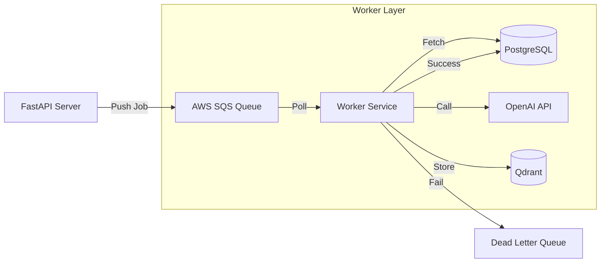

# Worker Architecture & Background Processing

## Overview

To ensure the API remains fast and responsive, all heavy lifting (content ingestion, AI analysis, clustering) is offloaded to asynchronous background workers. This document details the architecture, queue design, and job lifecycles.

**Key Technologies**:
- **Queue**: AWS SQS (Simple Queue Service)
- **Compute**: AWS Lambda (for short tasks) or ECS Fargate (for long-running tasks)
- **Language**: Python 3.11+
- **Libraries**: `boto3`, `pydantic`, `tenacity`

---

## Architecture Diagram



---

## Queue Design

We use a **multi-queue strategy** to separate high-priority user actions from background maintenance.

### 1. `content-processing-queue` (High Priority)
- **Purpose**: Processing new content saves immediately.
- **Visibility Timeout**: 5 minutes (max time for ingestion + analysis).
- **Concurrency**: High (scale up to 100+ concurrent workers).
- **Triggers**: `POST /items`

### 2. `clustering-queue` (Low Priority / Batch)
- **Purpose**: Re-calculating user clusters.
- **Visibility Timeout**: 15 minutes.
- **Concurrency**: Low (limit to avoid DB thrashing).
- **Triggers**: Nightly cron, or every N saves.

### 3. `dead-letter-queue` (DLQ)
- **Purpose**: Catch failed jobs after max retries.
- **Retention**: 14 days.
- **Alerting**: CloudWatch Alarm if messages > 0.

---

## Job Definitions

Each message in SQS is a JSON object with a `job_type` and `payload`.

### 1. `ingest_content`
**Payload**:
```json
{
  "job_type": "ingest_content",
  "shared_content_id": "uuid-string",
  "url": "https://..."
}
```
**Steps**:
1. Fetch metadata (Title, Thumbnail, etc.).
2. If video, fetch/generate transcript.
3. Update `shared_content` status to `PROCESSING`.
4. Trigger `analyze_content` job.

### 2. `analyze_content`
**Payload**:
```json
{
  "job_type": "analyze_content",
  "shared_content_id": "uuid-string"
}
```
**Steps**:
1. Read enriched data from DB.
2. Call LLM for semantic analysis (Topic, Category, Intent).
3. Generate Embedding vector.
4. Store in DB and Vector DB.
5. Update status to `READY`.

### 3. `cluster_user`
**Payload**:
```json
{
  "job_type": "cluster_user",
  "user_id": "uuid-string"
}
```
**Steps**:
1. Fetch all user embeddings.
2. Run HDBSCAN/Agglomerative clustering.
3. Identify new clusters.
4. Generate labels for new clusters.
5. Update `clusters` and `cluster_memberships` tables.

---

## Worker Implementation Pattern

We use a robust "Processor" pattern to handle jobs.

### Base Processor
```python
class BaseProcessor:
    def process(self, message: dict):
        job_type = message.get("job_type")
        if job_type == "ingest_content":
            return self.handle_ingest(message)
        elif job_type == "analyze_content":
            return self.handle_analyze(message)
        # ...
```

### Idempotency & Locking
Workers must be idempotent. A job might be delivered twice.
- **Check Status**: Before starting `ingest`, check if status is already `READY`.
- **Optimistic Locking**: Use DB versioning to prevent race conditions.

### Error Handling
- **Transient Errors** (Network, Rate Limits): Raise exception -> SQS retries automatically (Visibility Timeout).
- **Permanent Errors** (Invalid URL, 404): Catch, log, mark content as `FAILED`, and delete message from queue (don't retry).

---

## Scaling Strategy

### AWS Lambda (Recommended for MVP)
- **Trigger**: SQS Event Source Mapping.
- **Batch Size**: 1 (process one by one for isolation) or 5-10 for throughput.
- **Scaling**: Auto-scales by AWS based on queue depth.
- **Cost**: Pay per ms. Cheap for sporadic usage.

### ECS Fargate (Alternative for Heavy Load)
- **Trigger**: KEDA (Kubernetes Event-driven Autoscaling) or CloudWatch Alarms.
- **Scaling**: Add tasks when `ApproximateNumberOfMessagesVisible` > Threshold.
- **Cost**: Cheaper for sustained high throughput.

---

## Monitoring & Observability

### Key Metrics
1. **Queue Depth**: `ApproximateNumberOfMessagesVisible` (Is the system backed up?)
2. **Age of Oldest Message**: (Are jobs getting stuck?)
3. **Processing Duration**: How long does ingestion take?
4. **Failure Rate**: DLQ message count.

### Logging
Structured JSON logging is mandatory (see `api.md` Production Requirements).
```json
{
  "level": "INFO",
  "job_type": "ingest_content",
  "content_id": "...",
  "duration_ms": 450,
  "status": "success"
}
```

---

## Development Workflow

### Local Development
Use `localstack` or a local Redis queue (Celery/RQ) to simulate SQS.
- **Docker Compose**: Spin up Redis + Worker container.
- **API**: Pushes to Redis instead of SQS when `ENV=local`.

### Deployment
- **Infrastructure**: Terraform creates SQS queues and DLQs.
- **Code**: CI/CD pipeline builds Docker image -> Pushes to ECR -> Updates Lambda/ECS.
